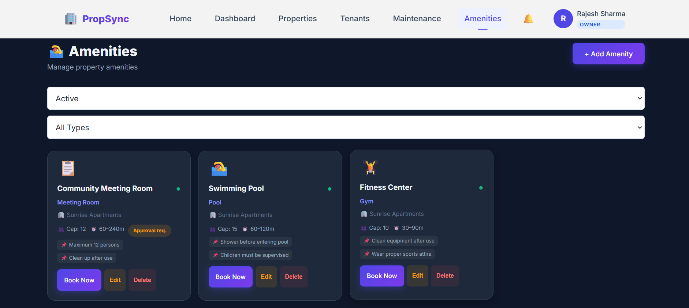
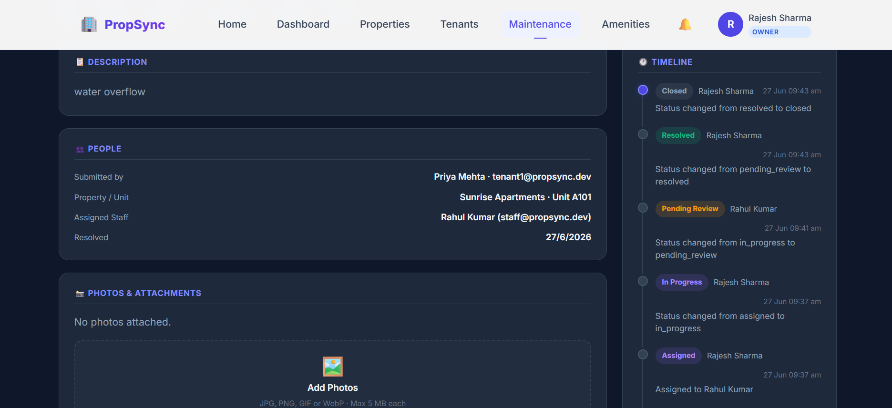

# 🏢 PropSync — Property Rental, Maintenance & Amenity Management Platform

> **Full-stack SaaS** for managing rental properties, tenants, maintenance workflows, and shared amenities — built with the MERN stack (MongoDB · Express · React · Node.js).

[](https://github.com/nihalsingh571/PropSync)
[](LICENSE)
[](https://prop-sync.vercel.app/)

---

## 🌐 Live Demo

You can access the live application here: **[https://prop-sync.vercel.app/](https://prop-sync.vercel.app/)**

---

## 📸 Screenshots

| Landing Page | Login Screen |
|:---:|:---:|
|  |  |

| Owner Dashboard | Admin Dashboard |
|:---:|:---:|
|  |  |

| Properties Listing | Amenities Booking |
|:---:|:---:|
|  |  |

| Maintenance Workflow |
|:---:|
|  |

---

## ✨ Features

| Domain | Highlights |
|---|---|
| **Authentication & Security** | Secure JWT authentication, password hashing with bcrypt, role-based access (Admin · Property Owner · Tenant · Maintenance Staff) |
| **Google Authenticator (2FA)** | Advanced 2FA security settings for Admin profile logins featuring dynamic QR Code generation and 6-digit TOTP validation |
| **Pre-Registration Email OTP** | Pre-registration email validation via SendGrid (with a smart demo-mode fallback) to verify email addresses before creating accounts |
| **Property Management** | Full property CRUD operations, dynamic units indexing, status tracking, and image storage configurations |
| **Tenant Management** | Leases lifecycle tracking (active · notice · vacated), lease expiry alerts, and tenant rosters |
| **Maintenance Workflows** | Structured state machine (`Open` $\rightarrow$ `In Progress` $\rightarrow$ `Resolved`), staff assignment, issue descriptions, and attachment support (optimized for Vercel memory storage) |
| **Amenity Booking Calendar** | Visual timeline bookings, check-in and check-out tracking, and robust conflict prevention logic to avoid double bookings |
| **Notifications & Real-time** | Live in-app notification alerts, unread counts, and real-time status updates powered by event-driven Socket.IO |
| **KPIs & Dashboards** | Interactive dashboards customized per-role featuring charts, live user analytics, and system metrics using Recharts |

---

## 🛠️ Tech Stack

**Backend**
- Node.js 20 + Express 4
- MongoDB Atlas + Mongoose 7
- Socket.IO 4 (real-time events)
- JWT + bcrypt (auth)
- SendGrid (email, optional)

**Frontend**
- React 18 + TypeScript
- Vite 5 (bundler)
- TanStack React Query (server state)
- React Router 6
- Recharts (admin analytics)
- Vanilla CSS (no Tailwind dependency)

---

## 📁 Project Structure

```
PropSync/
├── client/               # React + TypeScript SPA (Vite)
│   ├── src/
│   │   ├── components/   # Shared UI components (Navbar, Admin layout, etc.)
│   │   ├── contexts/     # Auth, Toast, Realtime contexts
│   │   ├── lib/          # API clients (propertyApi, tenantApi, notificationApi…)
│   │   ├── pages/        # Route-level pages per domain
│   │   └── stores/       # Zustand admin store
│   ├── vercel.json       # Vercel deployment config
│   └── .env.example      # Frontend env vars template
│
└── server/               # Express API
    ├── controllers/      # Request handlers
    ├── models/           # Mongoose schemas
    ├── routes/           # Express routers
    ├── services/         # Business logic (amenity, notification, realtime…)
    ├── middleware/        # Auth, error handling
    ├── render.yaml       # Render.com deployment config
    └── .env.example      # Backend env vars template
```

---

## 🚀 Local Development

### Prerequisites
- Node.js ≥ 18
- MongoDB Atlas account (or local MongoDB)
- npm ≥ 9

### 1. Clone & Install

```bash
git clone https://github.com/nihalsingh571/PropSync.git
cd PropSync
npm install          # installs root + all workspaces
```

### 2. Configure Environment

```bash
# Backend
cp server/.env.example server/.env
# Edit server/.env — set MONGODB_URI and JWT_SECRET

# Frontend (optional — defaults to localhost:8000)
cp client/.env.example client/.env.local
```

### 3. Start Dev Servers

```bash
# Terminal 1 — Backend (http://localhost:8000)
npm run dev:server

# Terminal 2 — Frontend (http://localhost:5173)
npm run dev:client
```

Or start both together (if you have concurrently installed):

```bash
npm run dev
```

### 4. Seed Data (Optional)

```bash
npm run seed --workspace server
```

---

## ☁️ Deployment

### Backend → Render.com

1. Go to [render.com](https://render.com) → **New → Web Service**
2. Connect your GitHub repo → set **Root Directory** to `server`
3. Render auto-detects `render.yaml` — review the settings
4. In the **Environment** tab, set:
   | Variable | Value |
   |---|---|
   | `MONGODB_URI` | Your Atlas connection string |
   | `CLIENT_URL` | Your Vercel frontend URL (e.g. `https://prop-sync.vercel.app`) |
5. Click **Deploy**. Note your API URL (e.g. `https://propsync-api.onrender.com`).

### Frontend → Vercel

1. Go to [vercel.com](https://vercel.com) → **New Project** → Import from GitHub
2. Set **Root Directory** to `client`
3. Add Environment Variable:
   | Variable | Value |
   |---|---|
   | `VITE_API_URL` | `https://propsync-api.onrender.com/api` |
4. Click **Deploy**. Vercel auto-detects the Vite framework.
5. Copy your Vercel URL and paste it back into Render as `CLIENT_URL`.

> ⚠️ **Free tier note**: Render free tier spins down after 15 minutes of inactivity. The first request after sleep may take 30–60 seconds. Upgrade to Starter ($7/mo) for always-on.

---

## 👤 Default Roles

| Role | Access & Capabilities |
|---|---|
| `admin` | **System Administrator**: Full system oversight, User Management (promote/demote/suspend), Admin Audit Activity logs, real-time KPI monitoring (Recharts charts, user growth, role distributions), global system health metrics, and Google Authenticator (2FA) security configuration. |
| `property_owner` | **Property Owner / Manager**: Register new properties (details, units indexing, Unsplash uploads), onboard and invite tenants to specific units, view and filter active tenants roster, track maintenance requests queue for their properties, and configure shared amenities. |
| `tenant` | **Tenant / Resident**: View active lease details (units, dates), create and track maintenance requests (with priority levels and attachment support), view available shared amenities schedule, and submit slot bookings on the timeline calendar. |
| `maintenance_staff` | **Maintenance Technician**: View assigned maintenance jobs queue, detail timelines, and update task status (`Open` $\rightarrow$ `In Progress` $\rightarrow$ `Resolved`) with status logs. |

New accounts default to `tenant`. An admin must upgrade roles via the Admin → Users panel.

---

## 📡 API Endpoints

| Base Path | Description |
|---|---|
| `POST /api/auth/register` | Create account |
| `POST /api/auth/login` | Login, receive JWT |
| `/api/properties` | Property CRUD (owner/admin) |
| `/api/tenants` | Tenant CRUD + lease management |
| `/api/maintenance` | Maintenance request lifecycle |
| `/api/amenities` | Amenity CRUD + booking system |
| `/api/notifications` | Notification management |
| `/api/admin/*` | Admin analytics + user management |

Full API responses follow: `{ message, data, meta }` convention.

---

## 🔒 Security

- All `.env` files are excluded from git via `.gitignore`
- JWT tokens expire after `JWT_EXPIRE` (default 30 days)
- Passwords hashed with bcrypt (10 rounds)
- CORS restricted to `CLIENT_URL` origins in production
- HTTP security headers set via Vercel config (`X-Frame-Options`, `X-Content-Type-Options`, etc.)

---

## 📄 License

MIT © 2024 [Nihal Kumar Singh](https://github.com/nihalsingh571)
